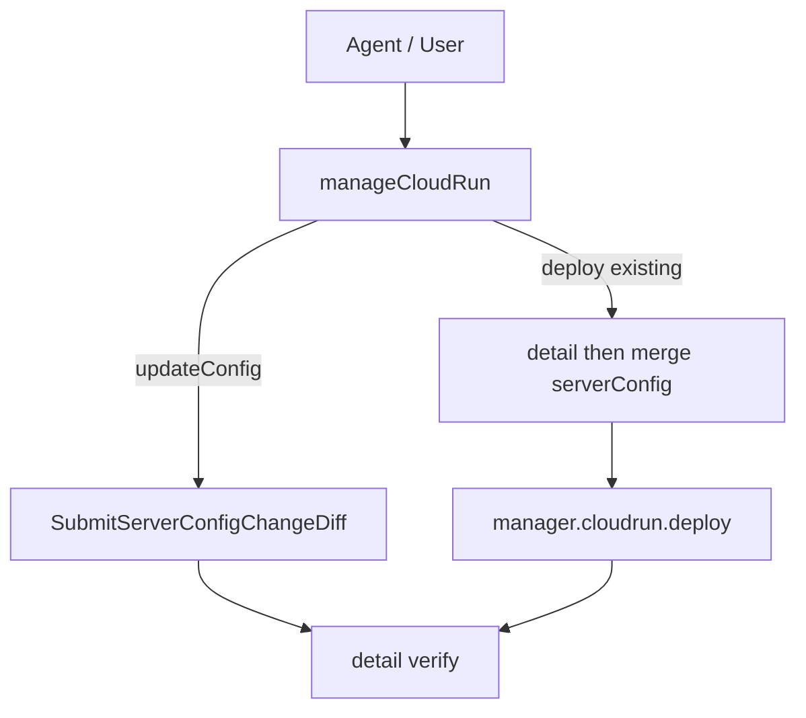

# 技术方案

## 概述

在 MCP `manageCloudRun` 中增加两类能力：

1. **deploy RMW**：对已存在服务，先 `detail` 再合并 `serverConfig`，再调用现有 Manager `cloudrun.deploy`。
2. **updateConfig**：新增 action，经 `commonService('tcbr','2022-02-17')` 调用 `SubmitServerConfigChangeDiff`，对齐控制台服务设置页。

不修改 `@cloudbase/manager-node` 包本身（SDK 仍无独立 updateConfig）；MCP 层补齐合并与 Diff 调用。长期可再回推 SDK。

## 架构



## Merge 规则（deploy）

优先级：`explicitInput` > `remote ServerConfig`（对未传入字段）。

| 字段 | 策略 |
|------|------|
| `VpcConf` | 输入完整则用输入；否则保留远程 |
| `EnvParams` | JSON 对象按 key merge；输入 key 覆盖远程；远程其余保留。`envParamsReplaceAll=true` 时用输入整包替换 |
| `OpenAccessTypes` | 输入有则用输入；否则保留远程（抵消 SDK 更新路径强制默认三件套） |
| 其他标量/对象 | 输入有则用输入；否则不写入 merged 对象（让 SDK Items 不带该 key） |

实现为纯函数 `mergeCloudRunServerConfig({ remote, input, options })`，便于单测。

注意：Manager SDK 更新路径会 `Object.assign({}, serverConfig, { OpenAccessTypes: ['OA','PUBLIC','MINIAPP'] })`。因此 **MCP 必须在合并结果中始终显式带上最终 `OpenAccessTypes`**（来自 input 或 remote），避免被 SDK 默认值覆盖。

## updateConfig

### 调用

```ts
await manager.commonService("tcbr", "2022-02-17").call({
  Action: "SubmitServerConfigChangeDiff",
  Param: {
    EnvId,
    ServerName,
    Items: parseObjectToDiffConfigItem(dirtyServerConfig),
  },
});
```

### Diff 映射（与控制台 / Manager parseObjectToDiffConfigItem 对齐）

| 输入字段 | Diff Key | 载荷形态 |
|----------|----------|----------|
| Cpu | CpuSpecs | FloatValue |
| Mem | MemSpecs | FloatValue |
| OpenAccessTypes | AccessTypes | ArrayValue |
| EnvParams | EnvParam | Value (string) |
| CustomLogs | LogPath | Value |
| VpcConf | VpcConf | VpcConf |
| 其他 | 同名 | 按类型 |

校验：`Cpu`/`Mem` 成对；`Items` 为空则 no-op 成功。

### 热更 vs 发版（文档化，不在 MCP 内重实现后端判定）

响应文案说明：变更可能热更（MinNum/MaxNum/PolicyDetails/AccessTypes/TimerScale/InternalAccess/SessionAffinity 全为这类时），否则后端会用线上镜像发新版（含 VpcConf/EnvParams/Cpu/Mem 等）。

## Schema 变更

- `action` 枚举增加 `updateConfig`
- 可选 `envParamsReplaceAll: z.boolean()`（仅 deploy / updateConfig 影响 EnvParams 合并）
- `updateConfig` 不要求 `targetPath`；要求 `serverConfig` 至少一个字段

## 测试

- `cloudrun-config-merge.test.ts`：VpcConf / EnvParams key-merge / OpenAccessTypes / replaceAll
- `cloudrun-diff-items.test.ts`：字段映射与 Cpu/Mem 成对校验
- 现有 `cloudrun.db-network.test.ts` 保持不变

## 安全性

- 不在日志中打印完整 EnvParams 密钥值（复核快照可只返回 key 列表 + 是否含 VpcConf）
- `updateConfig` 标为非 readOnly；破坏性低于 delete，高于纯查询

## 非目标（本迭代）

- 不改 Manager SDK 公开发布 API
- 不改 CLI `tcb cloudrun`
- 不做控制台级异步任务长轮询到终态（返回 taskId + 指引用 queryCloudRun/getDeployLog）
