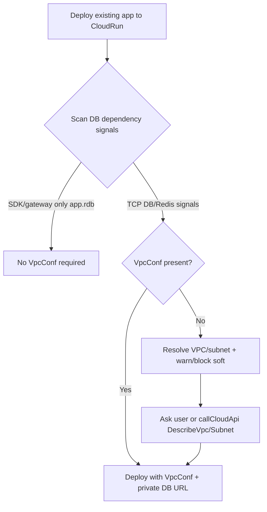

# 技术方案

## 目标

补齐「已有应用 → 云托管 + 传统 TCP 数据库」场景的网络配置引导，减少部署后才发现 VPC 不通的失败。

## 架构决策

## 改动面

| 层 | 改动 | 说明 |
|----|------|------|
| Skill | `cloudrun-development` + `references/vpc-and-database.md` | 部署门禁、概念区分、示例 |
| Protocol | `deployment-gate.md` | CloudRun 表增加 VPC 检查项 |
| PG skill | `troubleshooting.md` | TCP/VPC 排障与原生 PG 分流 |
| Ops | `ops-inspector` 简短指引 | 连库失败优先查 VPC |
| MCP | `manageCloudRun` schema + deploy warning | EnvParams 有 DB 信号但无 VpcConf 时返回 warnings |
| 产物 | tools.json / mcp-tools.md / prompts / skill mirrors | 同步生成 |

## 不做（本迭代）

- 不自动创建 VPC/子网（需账号侧权限与规划，风险高）
- 不在工具侧硬失败阻断 deploy（避免误伤无 DB 或公网白名单场景）；以强 warning + skill 门禁为主
- 不把 CloudBase PG gateway 路径改成强制 VPC

## 测试策略

- 纯函数单测：`detectCloudRunDbNetworkRisk(envParams, vpcConf)` 覆盖有/无 DB 信号、有/无 VpcConf
- 本地跑 `sync-claude-skills-mirror` / `sync-cloudbase-plugin-skills` / prompts & tools 生成
