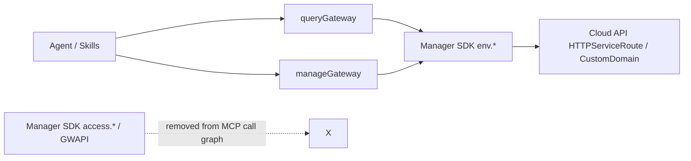

# Technical Design

## Overview

彻底移除 MCP 网关旧 GWAPI 语义（`access.*` / `CreateCloudBaseGWAPI` 等），将 `queryGateway` / `manageGateway` 收敛为与 Manager SDK v5 Domain/Route 及 CLI（`tcb domains` / `tcb routes`）一致的单一数据面。

MCP **直接调用** `cloudbase.env.*HttpServiceRoute` / `bindCustomDomain` / `deleteCustomDomain`，不封装、不回退到 `cloudbase.access.*`。

## Architecture



### Tool surface (after)

| Tool | Actions |
|------|---------|
| `queryGateway` | `listRoutes`, `getRoute`, `listCustomDomains` |
| `manageGateway` | `createRoute`, `updateRoute`, `deleteRoute`, `bindCustomDomain`, `deleteCustomDomain` |

### Removed from schema

| Removed | Replacement |
|---------|-------------|
| `getAccess` | `getRoute`（按 `targetName` / `path` / `domain` / `routeId`） |
| `listDomains` | `listRoutes`（含 Domain 元数据）或 `listCustomDomains` |
| `createAccess` | `createRoute`（可省略 `domain` → 解析默认域名；`type` 映射上游类型） |
| `deleteAccess` | `deleteRoute`（`Domain + Path`） |
| `updatePathAuth` | `updateRoute`（`EnableAuth` / `auth`） |

## Module design

Primary file: `mcp/src/tools/gateway.ts`（+ `gateway.test.ts`）。

### Helpers

1. **`listHttpServiceRoutes(filters?)`**  
   封装 `env.describeHttpServiceRoute({ EnvId, Filters?, Limit })`。  
   默认 `Limit` 取足够大（如 1000）以免漏默认域名。

2. **`resolveDefaultHttpDomain()`**  
   - 从 `Domains` 选 `IsDefault === true` 且可用（优先 `Enable !== false`，可选 `Status === "SUCCESS"`）。  
   - **禁止**使用 `OriginDomain` 作为公网落点。  
   - 失败：抛出明确中文错误（开通 HTTP 访问 / 显式传 `domain`）。

3. **`resolveRouteDomain(preferred?)`**  
   - 有 `preferred` → 直接用。  
   - 否则 → `resolveDefaultHttpDomain()`。

4. **`mapUpstreamResourceType(input)`**  
   优先级：
   1. 显式 `route.upstreamResourceType` / `route.serviceType`（若已是枚举值）
   2. 顶层 `type`: `Event` → `SCF`，`HTTP` → `WEB_SCF`
   3. 兼容：`targetType === "function"` **不能**单独决定类型；缺 `type` / 显式枚举则拒绝
   4. `CBR` / `STATIC_STORE` / `LH` 仅通过显式枚举传入

5. **`normalizeRoutePayload(...)`**  
   产出 `CreateHttpServiceRoute` / `ModifyHttpServiceRoute` 所需结构：
   ```ts
   {
     EnvId,
     Domain: {
       Domain: string,
       Routes: [{
         Path,
         UpstreamResourceType,
         UpstreamResourceName,
         EnableAuth?,
         Enable?
       }]
     }
   }
   ```
   - `Path`：规范化为以 `/` 开头；默认 `/${targetName}`（与旧 createAccess 默认一致）。
   - `UpstreamResourceName`：`route.serviceName ?? targetName`。

6. **`flattenRoutes(describeResult)`**  
   保留现有扁平化；补充拼装 `urls: https://${Domain}${Path}`。

### Action handlers

#### queryGateway

| Action | Behavior |
|--------|----------|
| `listRoutes` | `describeHttpServiceRoute` → flatten；返回 `routes`、`total`、可选按 Domain 分组摘要 |
| `getRoute` | 过滤：`routeId` **或** `targetName`（= UpstreamResourceName）**或** `path`（+ 可选 `domain`）。返回匹配路由列表或单条 + `urls` |
| `listCustomDomains` | 从 `Domains` 过滤 `IsDefault !== true`（自定义域名）；返回 Domain 元数据（CertId、Status、DNSStatus、AccessType 等） |

不再提供 `listDomains` / `getAccess`。若需要“所有域名含默认”，调用方可从 `listRoutes` 的 Domain 字段去重，或后续若有强需求再加 `listDomains` **基于新接口**的只读别名——**本需求不恢复旧 listDomains**。

`getRoute` 建议支持可选 `domain` / `path` 输入（扩展现有 schema），以便精确定位；`targetName` 多匹配时返回列表并提示补充 `path`/`domain`。

#### manageGateway

| Action | Behavior |
|--------|----------|
| `createRoute` | resolve domain → map type → `createHttpServiceRoute`；成功 envelope 含 `domain`、`path`、`upstreamResourceType`、`upstreamResourceName`；nextActions：`getRoute` + permissions |
| `updateRoute` | 同 payload 形态 → `modifyHttpServiceRoute`（鉴权更新走此路径） |
| `deleteRoute` | resolve domain → `deleteHttpServiceRoute({ Domain, Paths })`；要求 `path` / `route.path` |
| `bindCustomDomain` / `deleteCustomDomain` | 保持现有 `env.*` 调用 |

### Schema changes

**`manageGateway`**

- `action`: 仅新枚举。
- 保留便捷字段（降低 Agent 迁移成本，但仍属新 action）：
  - `targetType`: `function`（可选，主要用于描述）
  - `targetName`: 函数名 / 上游名
  - `path`
  - `type`: `Event` \| `HTTP`（函数场景必填其一，或改用 `route.upstreamResourceType`）
  - `auth`: → `EnableAuth`
  - `domain`
  - `route`: 对象字段收紧：
    - `path`, `serviceName`
    - `upstreamResourceType`: `z.enum(["SCF","WEB_SCF","CBR","STATIC_STORE","LH"])`
    - 可保留 `serviceType` 作为 **deprecated alias** 仅当值已是上述枚举；**不再**接受 `"function"` 并默认 SCF。为减少歧义，本设计建议 **删除 `serviceType: "function"` 映射**，统一用 `upstreamResourceType` + 顶层 `type`/`targetName`。
  - 移除：`accessId`、`accessName`（旧主键）

**`queryGateway`**

- `action`: `listRoutes` \| `getRoute` \| `listCustomDomains`
- 增加可选：`path`、`domain`（配合 `getRoute`）
- 保留：`targetName`、`routeId`、`targetType`

### Type mapping table

| Agent input | UpstreamResourceType |
|-------------|----------------------|
| `type="Event"` | `SCF` |
| `type="HTTP"` | `WEB_SCF` |
| `upstreamResourceType="SCF"` | `SCF` |
| `upstreamResourceType="WEB_SCF"` | `WEB_SCF` |
| `upstreamResourceType="CBR"` | `CBR` |
| `upstreamResourceType="STATIC_STORE"` | `STATIC_STORE` |
| `upstreamResourceType="LH"` | `LH` |

| 误用 | 风险 |
|------|------|
| HTTP 函数 + `SCF` | `FUNCTION_PARAM_INVALID` / 网关内部错误 |
| Event 函数 + `WEB_SCF` | 调用形态不匹配 |

### Default domain resolution

```text
describeHttpServiceRoute(EnvId, Limit=1000)
→ candidates = Domains.filter(d => d.IsDefault === true)
→ pick first with Enable !== false (prefer Status SUCCESS if present)
→ else throw actionable error
```

不使用 `OriginDomain`。

### Error message guidelines

- 默认域名缺失：说明未开通 HTTP 访问 / 无 IsDefault；建议控制台开通或显式 `domain` + `createRoute`。
- 缺类型：明确要求 `type="HTTP"|"Event"` 或 `route.upstreamResourceType`。
- 删除缺 path：要求 `path` 或 `route.path`。
- 多匹配 getRoute：提示补充 `path`/`domain`。

## Downstream call sites (repo)

| Location | Change |
|----------|--------|
| `mcp/src/tools/gateway.ts` | 重写 action 集与 helpers |
| `mcp/src/tools/gateway.test.ts` | 全部改 mock `env.*`；删 access 断言 |
| `mcp/src/tools/functions.ts` | nextActions / message → `createRoute` + `getRoute` |
| `mcp/src/tools/functions.test.ts` | 同步期望文案 |
| `config/source/skills/cloud-functions/**` | 推荐路径与删 Plan B |
| `doc/mcp-tools.md` / prompts | 生成脚本刷新 |
| `tests/sts-resource-level-validation.test.js` 等 | 新 action |
| `examples/**`（若含 createAccess） | 更新示例 |
| `mcp/src/tools/capi.ts` | **保持**旧 GWAPI 黑名单；不改开放 |

`config/.claude/skills`、`plugin/`、`doc/prompts` 等为生成/镜像产物：改 source 后按项目脚本生成，不手改镜像。

## Compatibility / migration note (for PR)

破坏性：非法 enum，无运行时别名。

```text
createAccess  → createRoute   (+ type=HTTP|Event, 可省略 domain)
getAccess     → getRoute      (targetName / path / domain)
deleteAccess  → deleteRoute   (domain? + path)
updatePathAuth→ updateRoute   (auth / EnableAuth)
listDomains   → listRoutes 或 listCustomDomains
Type 1 / 6    → SCF / WEB_SCF
APIId         → Domain + Path
```

示例（HTTP 函数补默认域名入口）：

```js
manageGateway({
  action: "createRoute",
  targetType: "function",
  targetName: "myHttpFunction",
  type: "HTTP",
  path: "/api/hello",
  auth: false
})
```

## Testing strategy

1. **Unit**（`gateway.test.ts`）  
   - 默认域名：`IsDefault` 被选中；`OriginDomain` 不被单独当作 Domain  
   - 映射：Event→SCF、HTTP→WEB_SCF  
   - 缺 type 拒绝  
   - create/update/delete/get/list 调用参数形状  
   - 默认域名缺失错误文案  
   - schema enum 不含旧 action  

2. **Functions tool**  
   - 创建 HTTP 函数后的引导不含 `createAccess`/`getAccess`  

3. **Repo integration / STS**  
   - 网关步骤改新 action  

4. **Manual / 验收**（任务阶段）  
   - 默认域名补入口、自定义域名绑路由、HTTP vs Event、传播延迟、权限边界  

不引入为过评测的特殊分支。

## Security

- 仅改网关配置面；不自动改函数安全规则。  
- `auth` / `EnableAuth` 仅网关层。  
- 成功后 nextActions 继续指向 permissions。  
- CORS 安全域名 vs 自定义域名边界不变。  
- AI 不得通过 `callCloudApi` 使用旧 GWAPI（黑名单保持）。

## Risks and mitigations

| Risk | Mitigation |
|------|------------|
| 存量 Agent 仍调旧 action | schema 直接拒绝；PR/spec 迁移表；skill 全切 |
| 新旧数据面残留不一致 | MCP 只读新面；文档说明以 Domain/Route 为准；控制台/CLI 同模型 |
| `IsDefault` 在部分环境缺失 | 明确错误；允许显式 `domain` |
| `createRoute` 曾错误一律 SCF | 本设计强制类型映射与校验 |
| SDK `access` / `function.createAccessPath` 仍旧 | 范围外；总结记后续；MCP 不调用 |

## Non-goals

- Manager SDK `access` 模块改造或 `@deprecated`  
- 恢复旧 action 的成功兼容层或“仅报错别名”  
- 开放 `callCloudApi` 旧 GWAPI  
- 双写旧+新 API  

## Implementation notes

- 注释与 commit 信息使用英文（项目规范）。  
- MCP 工具 description / 用户可见 message 可继续中文。  
- 修改 schema 后跑既有 tools doc / prompts 生成脚本。  
- `route.serviceType`：建议移除对 `"function"`→SCF 的隐式映射，避免与 HTTP 冲突；以 `type` + `upstreamResourceType` 为准。
