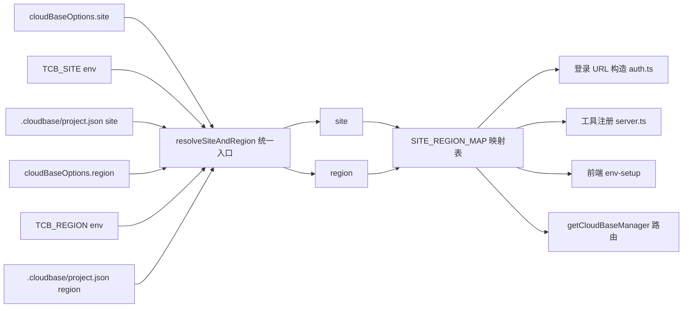

# 技术方案设计：MCP 多地域支持（site/region 解耦 + 数据驱动映射表）

> 状态：spec 草案（待确认）
> 日期：2026-08-13
> 前置：`requirements.md`（本 spec 需求）
> 原则：改动最小、数据驱动、兼容现有国内站上海用户

---

## 一、架构总览

在 `region` 之上新增 **site** 维度，形成两级模型：

```
site（国内站/国际站）──┬─→ authHost / 登录域名 / 账号体系 / 凭证槽位
                     └─→ region 列表（该站点的可用地域）
region（ap-shanghai/ap-singapore/...）──→ API 路由目标 + 资源所在地域
```



## 二、技术选型与设计要点

### 2.1 数据驱动映射表（核心）

新建 `mcp/src/utils/site-map.ts`（或并入 `tencent-cloud.ts`），类型安全、单一真源：

```ts
export type SiteId = "domestic" | "intl";

export interface SiteDefinition {
  id: SiteId;
  label: string;                    // "国内站" / "国际站"
  authHost: string;                 // 登录/OAuth 域名
  consoleHost: string;              // 控制台域名
  defaultRegion: string;            // 未指定 region 时的默认地域
  regions: string[];                // 该 site 支持的地域列表
  capabilities: {
    noSql: boolean;                 // 是否支持 NoSQL 数据库
    // 后续扩展：mysql / cloudRun / ... 
  };
}

export const SITE_REGION_MAP: Record<SiteId, SiteDefinition> = {
  domestic: {
    id: "domestic",
    label: "国内站",
    authHost: "tcb.cloud.tencent.com",
    consoleHost: "tcb.cloud.tencent.com",
    defaultRegion: "ap-shanghai",
    regions: ["ap-shanghai", "ap-guangzhou", "ap-singapore"], // 官方文档 + SDK SUPPORT_REGIONS
    capabilities: { noSql: true },
  },
  intl: {
    id: "intl",
    label: "国际站",
    authHost: "tcb.tencentcloud.com",
    consoleHost: "tcb.tencentcloud.com",
    defaultRegion: "ap-singapore",
    regions: ["ap-singapore"],                                // 实测；后续硅谷/法兰克福按公告追加
    capabilities: { noSql: false },
  },
};
```

- **国内站/国际站地域列表分别维护**：`domestic.regions` 与 `intl.regions` 独立数组，允许 `ap-singapore` 同时存在于两者（这正是解耦的意义）。
- 数据来源：官方地域文档 + manager-node SDK `SUPPORT_REGIONS` + 实测。后续新增地域只需改此表。

### 2.2 site/region 解析统一入口

新建 `resolveSiteAndRegion()`（收敛 cloudbase-manager 内 5 处 fallback）：

```ts
export type SiteResolution = { site: SiteId; region: string };

export function resolveSiteAndRegion(
  opts: { site?: string; region?: string } = {},
  projectConfig?: { site?: string; region?: string },
): SiteResolution
```

优先级链（与 Vercel 三级回退一致）：

```
显式 cloudBaseOptions.site/region
  > 环境变量 TCB_SITE / TCB_REGION / TCB_ENV_ID
  > .cloudbase/project.json (site/region)
  > 全局默认：site=domestic, region=ap-shanghai
```

**歧义处理**（需求 1.2 / 2.3）：当 `region` 在多个 site 的地域列表中都存在（如 `ap-singapore`）且未显式指定 site 时：
- `resolveSiteAndRegion` 返回 `{ ambiguous: true, candidates: [domestic, intl] }`；
- 上层（认证、工具调用）需要时提示用户显式指定 site，而不是静默按国际站处理；
- 为保持向后兼容，**认证流程**默认在歧义时按 `intl`（现状行为，需求 7.2），但返回提示让用户可显式指定。

### 2.3 getSite 替换 isInternationalRegion

```ts
// 旧
export const isInternationalRegion = (r) => r === "ap-singapore";
// 新（保留兼容名，内部查表）
export function getSite(region: string | undefined, explicitSite?: SiteId): SiteId | "ambiguous";
```

- `tencent-cloud.ts:8` 改为查 `SITE_REGION_MAP`，不再硬编码。
- `auth.ts`、`server.ts`、`env-setup/components.ts` 全部改用 `getSite`/`resolveSiteAndRegion`。

### 2.4 工具注册按能力集合

`server.ts:61-79` 改造：

```ts
function registerDatabase(server) {
  const { site, region } = resolveSiteAndRegion(server.cloudBaseOptions);
  if (SITE_REGION_MAP[site].capabilities.noSql) {
    registerDatabaseTools(server);   // 国内站默认支持
  }
  // 运行时探测增强：若 envQuery 已返回 RuntimeBackends，可用其覆盖
  registerDataModelTools(server);
}
```

- 保留映射表默认值，国际站默认 noSql=false（与现状一致）。
- 预留 `RuntimeBackends` 探测覆盖路径（需求 3.3），本 spec 范围可只做映射表默认值。

### 2.5 登录 URL 数据化

`auth.ts:436-450`：

```ts
const site = getSite(options?.region, options?.site);
const authHost = site !== "intl" ? "domestic" : "intl";  // 等价 SITE_REGION_MAP[site].authHost
```

- 删除 `url.replace("cloud.tencent.com", "tencentcloud.com")`。
- `fromCloudBaseLoginPage` 分支保留，但按 `site === "domestic"` 判定而非 `!isInternationalRegion(region)`。
- 前端 `env-setup/components.ts:15` 改 `site === "intl"` 判定。

### 2.6 多 site 凭证分槽（决策 4）

- 认证存储升级为 `credential[site]` 分槽。
- 兼容：读取时若旧 `credential` 直接存在（非分槽），视为 `domestic`。
- `loginByWebAuth({ site })` / `getLoginState({ site })` 显式传 site。

### 2.7 项目级配置文件 `.cloudbase/project.json`（决策 2）

最小格式 + 解析优先级见 `decisions.md`。读取层新增 `readProjectConfig(cwd)`（读 `.cloudbase/project.json`），失败返回 undefined 不阻塞。

---

## 三、迁移影响面

### 3.1 改动文件清单

| 文件 | 改动 | 风险 |
|---|---|---|
| `mcp/src/utils/tencent-cloud.ts` | 重写为 site-map 数据 + `getSite` | 低（被 3 处 import） |
| `mcp/src/utils/site-map.ts`（新增） | 映射表真源 | 低 |
| `mcp/src/cloudbase-manager.ts` | 5 处 region fallback 收敛为 `resolveSiteAndRegion` | 中（核心调用链） |
| `mcp/src/server.ts` | `registerDatabase`/`registerNoSQLDatabase` 改用能力集合 | 中（工具注册） |
| `mcp/src/auth.ts` | 登录 URL 数据化 + 凭证分槽 | 中（认证链路） |
| `mcp/src/templates/env-setup/components.ts` | site 判定替换 ap-singapore 硬编码 | 低 |
| `mcp/src/cli.ts` | 新增 `--site` CLI 参数（可选） | 低 |
| `specs` 相关文档 | README/连接方式说明 | 低 |

### 3.2 兼容性保证

- 未配置任何 site/region → domestic + ap-shanghai（与现状一致）。
- `TCB_REGION=ap-singapore` 国际站用户 → 保持 intl（现状行为，歧义默认 intl）。
- `TCB_REGION=ap-singapore` 国内站用户 → 需新增 `TCB_SITE=domestic` 或项目配置；文档给出迁移指引。
- auth.json 单槽数据 → 读取兼容，写回时升级为分槽。

### 3.3 测试策略

- 单元：`tencent-cloud`/`site-map` 映射表覆盖（含 ap-singapore 歧义）；`resolveSiteAndRegion` 优先级链。
- 组件：server 工具注册按 site 差异（国内站含 NoSQL，国际站不含）。
- 回归：现有国内站 ap-shanghai 用例全量通过；`TCB_REGION=ap-singapore` 国际站行为不变。
- 真实环境：国际站新加坡 env 实测（本 spec 已在 repro 中建立基线）。

---

## 四、非功能要求

- **数据驱动**：新增地域/站点不改判断代码，只改 `SITE_REGION_MAP`。
- **类型安全**：SiteId/Region 用 TypeScript 字面量联合 + `as const`，防止拼写漂移。
- **向后兼容**：默认行为与现状完全一致，迁移成本为 0（除非主动用多地域）。
- **安全**：凭证分槽不引入明文存储；OAuth token 存储沿用现有机制。

---

## 五、风险与开放项

1. **SDK 对国际站多地域的支持度**：manager-node 5.6.6 `SUPPORT_REGIONS` 仅含 ap-singapore，国际站若新增地域需先确认 SDK 是否支持；本 spec 只解耦 MCP 侧，SDK 侧留待后续。
2. **RuntimeBackends 探测**：是否在本次落地，或仅保留映射表默认值 —— 建议先做映射表，探测作为后续增强（需求 3.3 标记可选）。
3. **`.cloudbase/project.json` 与 `cloudbaserc.json` 关系**：独立文件，不并入，避免语义混杂。
4. **歧义默认 intl 的合理性**：国内站新加坡用户升级后若不显式配置，会被按 intl 处理（与现状一致但不正确）；需文档强提醒，spec 决策中确认"歧义提示"的交互方式。
