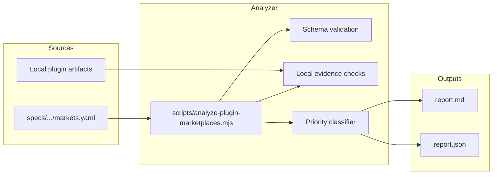

# 技术方案设计

## 介绍

落地「插件市场上架分析机制」：以仓库内 YAML 矩阵为唯一真源，配合 Node 分析脚本校验本地插件产物并生成上架可行性报告。首版离线优先、人工提交；不对接各平台提交 API。

## 架构



### 设计原则

1. **矩阵真源优先**：市场列表、状态、提交入口、证据链接全部来自 YAML；脚本不硬编码市场 ID 列表。
2. **离线默认**：默认只读本地矩阵 + 本地产物；网络探测为可选增强（`--online`），失败标 `skipped`。
3. **多状态并行**：同一市场用多个 `listing_statuses` 键，禁止单一 `listed: true`。
4. **报告可行动**：输出优先级分组与提交材料 checklist，明确标注「人工提交」。
5. **与现有构建解耦**：不修改 Open Plugin Spec / marketplace 构建流水线；只消费其产物路径。

## 技术选型

| 项 | 选择 | 理由 |
|----|------|------|
| 矩阵格式 | YAML | 仓库已有 `js-yaml@4.3.0`；人类可编辑 |
| 脚本 | Node ESM `.mjs` | 与现有 `scripts/*.mjs` 一致 |
| 测试 | vitest | 根目录已有 vitest |
| 报告 | Markdown + JSON | MD 给人看；JSON 给后续自动化 |
| 网络 | 默认关闭 | 避免 CI 抖动；可选 `--online` HEAD/GET 探测提交 URL |

不新增依赖。

## 目录与文件

```text
specs/plugin-marketplace-listing/
  requirements.md          # 已定稿
  design.md                # 本文件
  tasks.md                 # 下一阶段
  markets.yaml             # 市场矩阵真源
  README.md                # 维护说明（如何更新/跑脚本）
  reports/                 # 生成物（gitignore 可选；首版可提交一份示例报告）
    latest.md
    latest.json

scripts/
  analyze-plugin-marketplace.mjs   # CLI 入口
  lib/
    plugin-marketplace-matrix.mjs  # load + validate
    plugin-marketplace-evidence.mjs # local artifact checks
    plugin-marketplace-report.mjs   # priority + render

tests/
  plugin-marketplace-listing.test.js
```

`package.json` 增加脚本别名：

```json
"analyze:plugin-marketplaces": "node scripts/analyze-plugin-marketplace.mjs"
```

## 数据模型（`markets.yaml`）

```yaml
version: 1
reviewed_stale_days: 90
markets:
  - id: claude-code-community
    product: Claude Code
    region: global
    channel_type: community_plugin_directory  # enum, see below
    listing_statuses:
      official_curated: not_applicable
      community_directory: submittable
      self_marketplace: listed              # 本仓库已可 marketplace add
      native_connector_or_builtin: not_applicable
      open_plugin_spec: listed
      mcp_or_skill_registry: not_applicable
      docs_only: listed
    submit_url_or_process: |
      Submit via claude.ai or platform.claude.com plugin forms.
    eligibility: public_github_repo_required
    blockers: []
    evidence_links:
      - https://code.claude.com/docs/en/plugins
      - https://platform.claude.com/plugins/submit
    local_evidence:                    # optional hooks into local checks
      - self_marketplace_claude
      - open_plugin_spec_cloudbase
    submit_checklist:                  # optional; script merges with defaults by channel_type
      - Public GitHub repository URL
      - Valid plugin manifest
      - README with install/usage
    recommended_install_path: null     # or docs path when docs_only
    priority_hint: null                # optional override: ready_to_submit | ...
    last_reviewed_at: "2026-07-27"
    owner: cloudbase-ai-toolkit
```

### 枚举约束

**`channel_type`**（扩展时只加、不改语义）：

- `official_curated_marketplace`
- `community_plugin_directory`
- `self_hosted_marketplace`
- `native_connector_or_builtin`
- `open_plugin_spec_target`
- `mcp_registry_or_aggregator`
- `skill_registry`
- `editor_extension_marketplace`（如 Trae `.vsix`）
- `deeplink_or_install_assist`
- `docs_config_only`

**`listing_statuses.*` 取值**：`listed` | `submittable` | `blocked` | `not_applicable` | `unknown`

**`eligibility`**：自由短字符串（如 `public_github_repo_required`、`partner_outreach_required`、`n_a`），报告原样展示。

### 本地证据 ID（`local_evidence`）

脚本内建检查表，矩阵通过 ID 引用：

| ID | 检查路径 / 条件 |
|----|-----------------|
| `self_marketplace_claude` | `.claude-plugin/marketplace.json` 含 `cloudbase` |
| `self_marketplace_codex` | `.agents/plugins/marketplace.json`（优先）或根 `marketplace.json` 含 `cloudbase` |
| `open_plugin_spec_cloudbase` | `plugin/cloudbase/.plugin/plugin.json` 存在且含 `$schema` |
| `claude_plugin_manifest` | `plugin/cloudbase/.claude-plugin/plugin.json` |
| `codex_plugin_manifest` | `plugin/cloudbase/.codex-plugin/plugin.json` |
| `ops_publish_repo_docs` | `doc/ai-agent-plugins.mdx` 提及 `npx plugins add` |
| `cursor_plugin_manifest` | `plugin/cloudbase/.cursor-plugin/plugin.json` 或仓库根 `.cursor-plugin/`（缺失则报告缺口） |
| `trae_mcp_deeplink_docs` | `doc/ide-setup/trae.mdx` 或 IDESelector 深链相关证据 |

证据结果：`present` | `missing` | `invalid`，写入报告并影响优先级（例如 Cursor 缺 `.cursor-plugin` → `needs_packaging_or_manifest`）。

## 脚本行为

### CLI

```bash
node scripts/analyze-plugin-marketplace.mjs
node scripts/analyze-plugin-marketplace.mjs --strict
node scripts/analyze-plugin-marketplace.mjs --online
node scripts/analyze-plugin-marketplace.mjs --out specs/plugin-marketplace-listing/reports
```

| 参数 | 默认 | 含义 |
|------|------|------|
| `--matrix` | `specs/plugin-marketplace-listing/markets.yaml` | 矩阵路径 |
| `--out` | `specs/plugin-marketplace-listing/reports` | 输出目录 |
| `--strict` | off | schema 失败或关键 `local_evidence` 缺失 → exit 1 |
| `--online` | off | 对 `evidence_links` / submit URL 做可选可达性探测 |
| `--json-only` | off | 只写 JSON |

### 处理流水线

1. **Load + validate**：解析 YAML；校验必填字段、枚举、唯一 `id`。
2. **Local evidence**：按条目 `local_evidence` 跑检查表。
3. **Classify priority**（规则顺序，先匹配先生效；可用 `priority_hint` 覆盖）：
   - 任一商店类状态为 `listed` 且非纯 `docs_only` → `listed`
   - `channel_type` 为 `docs_config_only` / `editor_extension_marketplace`（且业务上不作为目标）→ `not_applicable`
   - 存在 `submittable` 且本地必需证据齐全、无 `blocked` → `ready_to_submit`
   - 存在 `submittable` 但本地证据 `missing`/`invalid` → `needs_packaging_or_manifest`
   - `eligibility` 含 partner / outreach，或状态全为 `unknown` 且无自助 submit URL → `needs_partner_outreach`
   - 其余 `unknown` → `unknown`
4. **Stale flag**：`last_reviewed_at` 早于 `reviewed_stale_days` → 报告「需复核」。
5. **Render**：写 `latest.md` + `latest.json`。

### 报告结构（Markdown）

1. 摘要计数（各组条数）
2. `ready_to_submit` 明细：checklist + 已有/缺失材料
3. `needs_packaging_or_manifest`
4. `needs_partner_outreach`
5. `listed`
6. `not_applicable` / `unknown`
7. 过期复核列表
8. 页脚声明：不自动提交

JSON 与 MD 同构，便于后续脚本消费。

## Trae 专项映射

| 矩阵 ID | channel_type | 初判优先级逻辑 |
|---------|--------------|----------------|
| `trae-mcp-marketplace` | `community_plugin_directory` 或专用 MCP 市场类型（可用 `mcp_registry_or_aggregator`） | 公开提交通道不明 → 默认 `needs_partner_outreach` / `unknown` |
| `trae-work-skills-marketplace` | `skill_registry` | 可本地上传；公开上架不明 → `unknown` / outreach |
| `trae-ide-extension` | `editor_extension_marketplace` | `not_applicable`（非 Agent Plugin 目标） |
| `trae-mcp-deeplink` | `deeplink_or_install_assist` | 文档已有 → `listed`（分发辅助）或 `docs_only: listed` |

## 首版矩阵填充策略

- 调研结论写入 YAML 初值；不确定处显式 `unknown`，不留空字段。
- WorkBuddy / ZCode：`native_connector_or_builtin: listed`。
- Claude / Codex 自建 marketplace + OPS：对应状态 `listed`。
- Claude community / Cursor marketplace / Codex universal / Grok PR：`submittable` + checklist。
- MCP 聚合目录：单独条目；与 IDE 商店状态解耦。
- `IDE_TYPES` 兜底条目：`docs_config_only`，指向 `doc/ide-setup/{id}.mdx`（存在则链上，不存在标缺失文档）。

## 测试策略

`tests/plugin-marketplace-listing.test.js`：

1. 合法矩阵 fixture 可通过 validate。
2. 缺必填字段 / 非法枚举 / 重复 id → validate 抛错。
3. 对真实仓库跑 evidence：现有 Claude/Codex/OPS 产物为 `present`；Cursor `.cursor-plugin` 若缺失则为 `missing`（断言与仓库现状一致，不伪造）。
4. 离线模式调用主入口（可用临时 `--out`）exit 0，且生成 md/json。
5. 严格模式：用故意缺证据的临时矩阵 → exit ≠ 0。

不强制在 CI 默认 job 加网络探测。

## 安全性

- 不读写密钥；不调用需鉴权的提交 API。
- `--online` 仅做公开 URL 探测，超时短、失败不抛未捕获异常。
- 报告与矩阵禁止写入 token / 内网地址。

## 非目标（设计层再次确认）

- 不实现自动提交到 Claude / Cursor / OpenAI / Trae 等。
- 不新增 Cursor/Qoder 等厂商 manifest 的构建流水线（报告可指出缺口；补产物另开任务）。
- 不替代 `doc/ai-agent-plugins.mdx` 用户文档。

## 风险与缓解

| 风险 | 缓解 |
|------|------|
| 外部提交政策变化 | `last_reviewed_at` + stale 告警；evidence 链接可点开复核 |
| 矩阵膨胀 | 按 A–E 分类注释；脚本按 `channel_type` 过滤可选（后续增强，首版全量输出） |
| 优先级误判 | 允许 `priority_hint` 人工覆盖；测试覆盖典型规则 |
| Trae 提交通道不透明 | 明确 `unknown`/`needs_partner_outreach`，避免假阳性 `ready_to_submit` |
